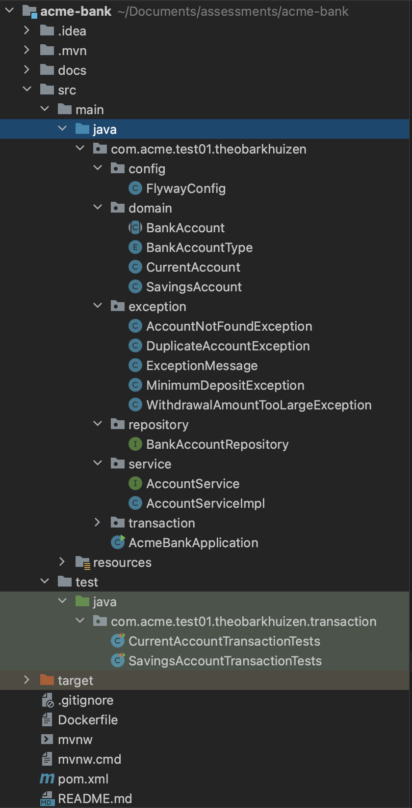

<h1 align="center">
  <br>
  <a></a>
  <br>
  ACME Bank Take Home Assignment
  <br>
</h1>

<p align="center">
    <a alt="Java">
        
    </a>
    <a alt="Spring Boot">
        
    </a>
    <a alt="Spring Framwwork">
        
    </a>
    <a alt="Docker">
        
    </a>
    <a alt="Dependencies">
        
    </a>
    <a alt="Contributions">
        
    </a>
    <a alt="License">
        
    </a>
</p>

## Table of Contents ##
1. [Philosophy](#Philosophy)
3. [Spring Boot](#Spring-Boot)
4. [Application](#Application)
5. [Technology](#Technology)
6. [Application Structure](#Application-Structure)
7. [Run Locally](#Running-the-server-locally)
8. [Run Insider Docker](#Running-the-server-in-Docker-Container)
9. [License](#License)

## Philosophy ##
A lot of work has gone into Spring Boot to reduce complexity and dependencies, which largely alleviates our previous reservations. If you live in a Spring ecosystem and are moving to microservices, Spring Boot is now the obvious choice. Spring Boot allows easy set up of standalone Spring-based applications. It's ideal for pulling up new microservices and easy to deploy. It also makes data access less of a pain due to the hibernate mappings with much less boilerplate code. You can get started with minimum fuss due to it taking an opinionated view of the Spring platform and third-party libraries. Most Spring Boot applications need very little Spring configuration. 

The greatest thing about Spring Boot is the ability to be up and running in very little time. You don’t have to install a web server like JBoss, Websphere, or even Tomcat for that matter. All you need to do is pull in the proper libraries, annotate, and fire away. If you are going to do a lot of Spring Boot projects. 


## Spring Boot ##
_Spring Boot makes it easy to create stand-alone, production-grade Spring based Applications that you can just run. We take an opinionated view of the Spring platform and third-party libraries so you can get started with minimum fuss. Most Spring Boot applications need very little Spring configuration._

**Spring Boot is opinionated** : This simply means that Spring Boot has its own configurations, application structures, dependencies, Servers and other environment configuration available inside its realm. Thus, to say Spring Boot has its own opinions about an application development environment. For example, most of the Java-based web applications use tomcat server. While working on Spring Boot you need not use any server, because Spring Boot already has an embedded tomcat container.

**Spring Boot is stand-alone** : What it means is that you don’t need to use any other third-party library or server to run or develop a spring boot application, it already has all of it.

**It is production-grade** : This implies that application developed using Spring Boot defaults is able to handle all complexities and requirements of a production environment.

**Still very customizable** : It is not worth using a framework which has its own rigid opinions, which you can’t customize or change according to your own business requirements. Although Spring Boot is opinionated you can easily change or customize its defaults to suit your own needs. 

## Application ##
This application uses Spring Boot following all the best practices that are recommended by Spring Framework 6.0, ensure the code is loosely coupled and that all the layers in the application are completely independent of each other and talk using neutral objects.

  
## Technology ##
The following technologies were used during the development :

- **Spring Boot** - Server side framework
- **Docker** - Containerizing framework
- **Flyway** - Database Migration Framework


## Application Structure ##
Spring Boot is an opinionated framework that makes our life very easy since we don't have to choose the versions of different dependencies based on the version of Spring framework, its all taken care of by Spring Boot. I have tried to follow the same ideology while creating the project structure, at first it might seem like overwhelming, but do believe me once you start writing your pieces the structure will help you immensely by saving your time and thinking about questions which are already answered. The structure look as follows :

</a>

**_Models_**
The various models of the application are organized under the **_domain_** package of the service.

**_Transactions_**
The most important part is the transaction layer. Processing of deopsits and withdrawals are done in this layer. This pattern breaks the traditional one of having the deposit and withdraw methods as instance methods. Although this conforms to the OOP principles of class behaviours, there are a lot more benefits of seperating the processing from the instance itself.

## Exception Handling ##
Exception handling is done at a global level and is present in the **_exception_** package.

The package has 4 defined exceptions, _AccountNotFoundException_, _DuplicateAccountException_, _MinimumDepositException_ and _WithdrawAmountTooLargeException_. 


## Running the server locally ##
To be able to run this Spring Boot app you will need to first build it. To build and package a Spring Boot app into a single executable Jar file with a Maven, use the below command. You will need to run it from the project folder which contains the pom.xml file.

```
maven package
```
or you can also use

```
mvn clean install
```

To run the Spring Boot app from a command line in a Terminal window you can you the java -jar command. This is provided your Spring Boot app was packaged as an executable jar file.

```
java -jar target/acme-bank-0.0.1-SNAPSHOT.jar
```

You can also use Maven plugin to run the app. Use the below example to run your Spring Boot app with Maven plugin :

```
mvn spring-boot:run
```

If you do not have a mysql instance running and still just want to create the JAR, then please use the following command:

```
mvn install -DskipTests
```

## Running the server in Docker Container (NOT TESTED) ##

##### Docker #####
Command to build the container :

```
docker build -t spring/acme-bank .
```

Command to run the container :

```
docker run -p 8080:8080 spring/acme-bank
```

## Contributors ##
[Theo Barkhuizen](https://www.linkedin.com/in/theodor-barkhuizen-b18597127/)

## License ##
This project is licensed under the terms of the shopriteX license.
